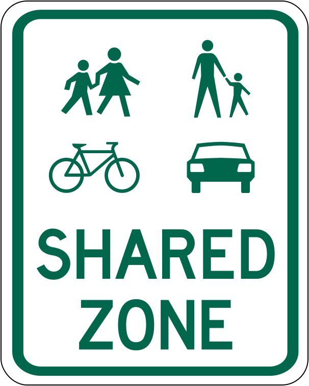

# Traffic-Sign-Sensing

The "Traffic Sign Sensing Using Object Detection with YOLOv8 and NAS-YOLO" project represents a cutting-edge application of computer vision. Additionally, the project has resulted in the creation of a research paper, contributing valuable insights and advancements to the field of traffic sign detection and autonomous driving systems.

  

## 
Models

YOLOv8 [Detect](https://docs.ultralytics.com/tasks/detect), [Segment](https://docs.ultralytics.com/tasks/segment) and [Pose](https://docs.ultralytics.com/tasks/pose) models pretrained on the [COCO](https://docs.ultralytics.com/datasets/detect/coco) dataset are available here, as well as YOLOv8 [Classify](https://docs.ultralytics.com/tasks/classify) models pretrained on the [ImageNet](https://docs.ultralytics.com/datasets/classify/imagenet) dataset. [Track](https://docs.ultralytics.com/modes/track) mode is available for all Detect, Segment and Pose models.

Detection (Road Signs)

| Model                                                                                | Precision | Recall | mAP50 | mAP50-95 |
| ------------------------------------------------------------------------------------ | --------------------- | -------------------- | ------------------------------ | ----------------------------------- |
| [YOLOv8n](https://github.com/ultralytics/assets/releases/download/v0.0.0/yolov8n.pt) | 97.9                   | 92.8                 | 95.3                           | 82.2                               |                 | 
| [YOLOv8s](https://github.com/ultralytics/assets/releases/download/v0.0.0/yolov8s.pt) | 98.3                   | 92                   | 94.9                           | 80.6                               |                |
| [YOLOv8m](https://github.com/ultralytics/assets/releases/download/v0.0.0/yolov8m.pt) | 91.8                   | 91.4                 | 94.3                           | 79                                 |                |
| [YOLOv8l](https://github.com/ultralytics/assets/releases/download/v0.0.0/yolov8l.pt) | 95.9                   | 87.9                 | 92                             | 76.6                               |                | 
| [YOLOv8x](https://github.com/ultralytics/assets/releases/download/v0.0.0/yolov8x.pt) | 93                     | 91.6                 | 91.9                           | 76.2                               |                | 
| [YOLONAS-l](https://github.com/Deci-AI/super-gradients/tree/master)                  | NA                     | 97.5                 | 95.7                           | NA                                 |                

- **mAPval** values are for single-model single-scale on [COCO val2017](http://cocodataset.org) dataset.
   Reproduce by `yolo val detect data=coco.yaml device=0`
- **Speed** averaged over COCO val images using an [Amazon EC2 P4d](https://aws.amazon.com/ec2/instance-types/p4/) instance.
   Reproduce by `yolo val detect data=coco.yaml batch=1 device=0|cpu`

